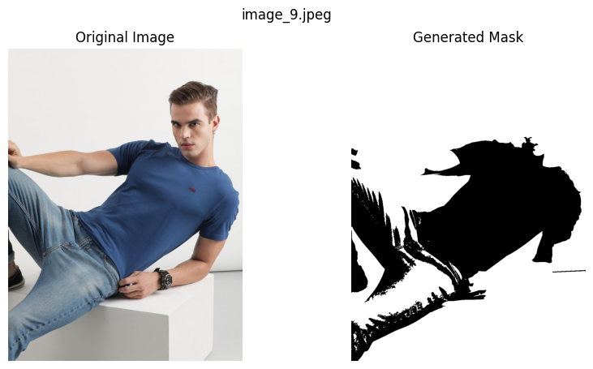

# Garment Masking Pipeline

## Overview

This project provides a Python-based pipeline to accurately extract garment areas from a set of sample images by generating corresponding binary masks. The pipeline uses OpenCV for image preprocessing and contour detection to create binary masks that highlight the garment regions.

### Key Features:
- **Object-Oriented Design**: The pipeline is organized into classes, each handling specific tasks like image processing, mask generation, and visualization.
- **Preprocessing**: Converts images to grayscale and applies Gaussian blur to reduce noise.
- **Mask Generation**: Uses thresholding and contour detection to create binary masks that accurately cover garment areas.
- **Visualization**: Displays the original images alongside their corresponding binary masks for easy evaluation.

### Output Images
Below are sample outputs showing the original images and their corresponding binary masks:




## Installation and Setup

### Requirements:
- Python 3.x
- OpenCV
- NumPy
- Matplotlib

### Installation:
1. **Clone the Repository**:
    ```
    git clone https://github.com/varunkatiyar819/garment-masking-pipeline.git
    cd garment-masking-pipeline
    ```

2. **Install Required Libraries**:
    It's recommended to create a virtual environment before installing the libraries.
    ```
    python -m venv venv
    source venv/bin/activate  # On Windows, use `venv\Scripts\activate`
    pip install -r requirements.txt
    ```

    If you don't have a `requirements.txt` file, you can manually install the dependencies:
    ```
    pip install opencv-python numpy matplotlib
    ```
## Running the Code

### Option 1: Using Jupyter Notebook

1. **Prepare Your Images**:
   - Place your sample images in the `images` directory (create the directory if it doesn't exist).

2. **Install Jupyter Notebook**:

   ```
   pip install jupyter
    ```

3. **Launch Jupyter Notebook**:

   ```
   jupyter notebook
    ```

4. **Running Notebook and View Results**
 - Open the notebook file (*garment_masking_pipeline.ipynb*) in your browser.
 - Run the cells to process all images and view the results asynchronously. This allows you to see all images and their corresponding masks at once.

### Option 2: Using Python Script (Synchronous Viewing)
1. **Prepare Your Images**:
   - Place your sample images in the `images` directory (create the directory if it doesn't exist).

2. **Run the Pipeline**:
    ```
    python garment_masking_pipeline.py
    ```

3. **View Results**:
   - The original images and their corresponding binary masks will be displayed side by side using Matplotlib.

## Assumptions and Decisions

- **Image Preprocessing**: Gaussian blur was chosen to reduce noise, which improves contour detection.
- **Thresholding**: A simple thresholding method was used based on the assumption that the garment areas have distinguishable intensity levels from the background.
- **Contour Detection**: This method works well for simple shapes and clear boundaries. For more complex images, a deep learning-based segmentation approach may be more effective.
- **Mask Post-processing**: No additional post-processing (like morphological operations) was applied to refine the mask, as the basic method was deemed sufficient for the provided samples.

## Future Enhancements
- **Deep Learning Integration**: Incorporating a U-Net or similar model to improve mask accuracy for more complex images.
- **Parameter Tuning**: Experimenting with different thresholding techniques and contour detection parameters for better results.
- **Batch Processing**: Extending the pipeline to handle large batches of images efficiently.

## License
This project is licensed under the MIT License - see the [LICENSE](LICENSE) file for details.
